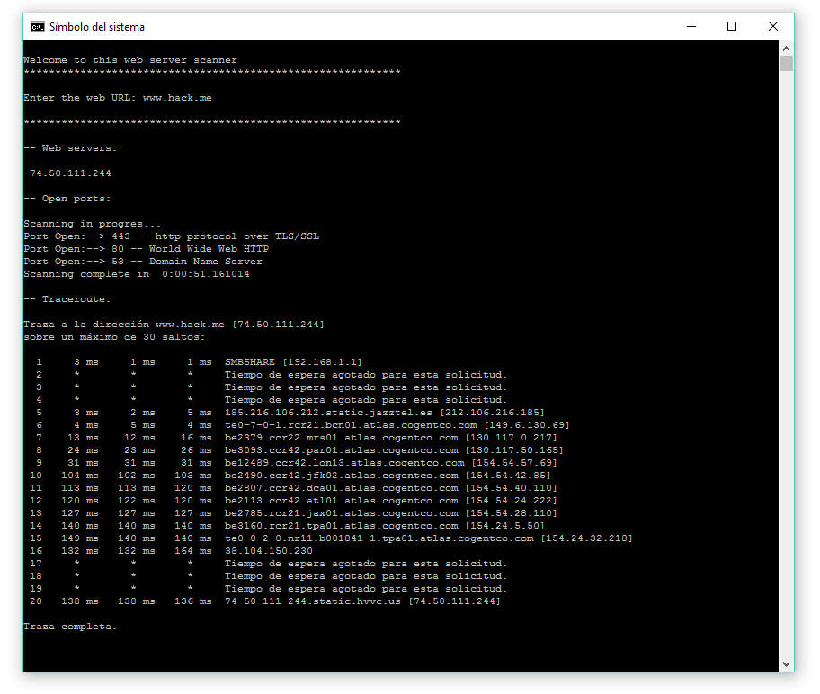

# server-scanner
This script checks the IPs of the servers associated with the given URL and checks the open ports of those servers. Aditionally, it performs a traceroute to o see the different ports that the packets cross before reaching the server.

Works on Windows systems. Just download the server-tester.py file and run it with the command line.
